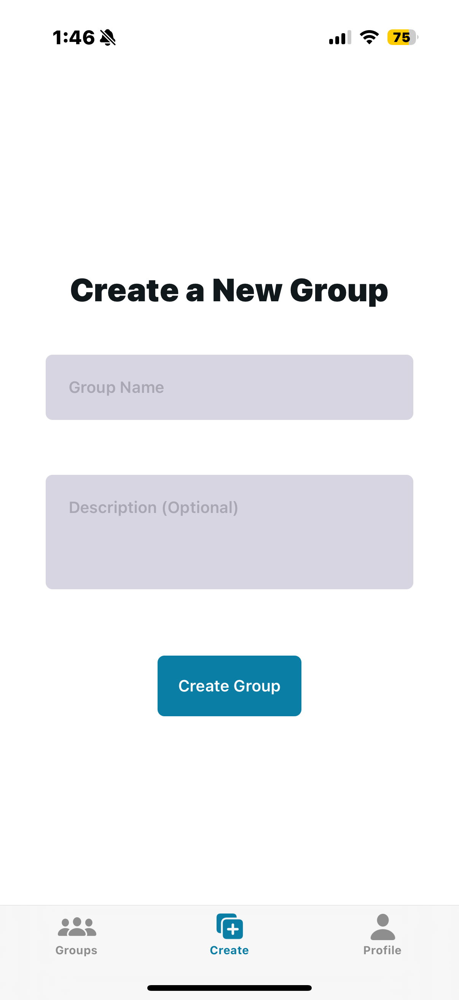
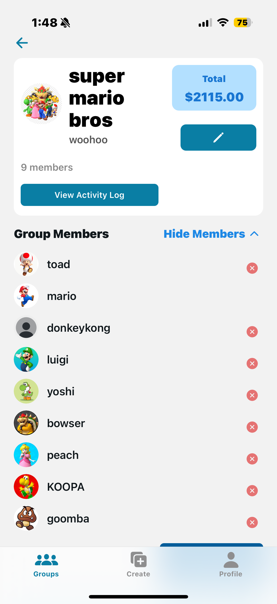

# Orbital 

## Team Name: BudgetBuddy  
**TeamID:** 7553

**Members:**  
- Goh Yi Heng Rayner  
- Josh Loh

---

## Table of Contents

1. [Project Overview](#project-overview)
    - [Proposed Level of Achievement](#proposed-level-of-achievement)
    - [Motivation](#motivation)
    - [Aim](#aim)
    - [User Stories](#user-stories)
2. [Features](#features)
    - [User Registration and Authentication](#user-registration-and-authentication-milestone-1)
    - [Group Creation and Management](#group-creation-and-management-milestone-2)
    - [Expense Tracking and Split Calculation](#expense-tracking-and-split-calculation-milestone-2)
    - [Debt Settling and Balance Calculation](#debt-settling-and-balance-calculation-milestone-2)
    - [Real-Time Updates](#real-time-updates-milestone-3)
    - [Balance Overview and Reports](#balance-overview-and-reports-milestone-3)
    - [Other Notable Features](#other-notable-features)
3. [Timeline and Development Plan](#timeline-and-development-plan)
4. [User Flow Diagrams](#user-flow-diagrams)
5. [Tech Stack](#tech-stack)
6. [Software Engineering Practices](#software-engineering-practices)
7. [Quality and Assurance](#quality-and-assurance)
8. [How to Run the App Locally](#how-to-run-the-app-locally)
9. [Challenges Faced](#challenges-faced)
10. [Bugs Squashed](#bugs-squashed)
11. [Conclusion](#conclusion)

---

## 1. Project Overview

### 1.1 Proposed Level of Achievement
**Apollo**

### 1.2 Motivation
Managing shared expenses is a common pain point for roommates, friends, and families. Manual calculations often lead to confusion and disputes. BudgetBuddy aims to automate and simplify group expense management, ensuring fairness and transparency for all users.

### 1.3 Aim
To build a cross-platform mobile app that enables users to track, manage, and split expenses within groups, automate debt calculation and settlement, and provide real-time updates and insights.

### 1.4 User Stories
- As a user, I want to register, log in, and manage my profile securely.
- As a user, I want to create groups, invite others, and manage group members.
- As a user, I want to add expenses to groups, specify who paid, and split costs equally or (in future) by custom percentages.
- As a user, I want to see a summary of all expenses, balances, and pending settlements.
- As a user, I want to mark debts as settled and see my updated balance.
- As a user, I want to receive real-time updates when expenses or settlements are made.

---

## 2. Features

### User Registration and Authentication (Milestone 1)
- **Description:** Secure sign-up, login, and profile management. Password recovery and session handling.
- **Implementation Philosophy:** Used Appwrite for backend authentication, with JWT and secure password hashing.
- **Implementation Challenges:** Ensuring robust error handling and smooth session management across devices.

### Group Creation and Management (Milestone 2)
- **Description:** Users can create groups, invite members, and manage group settings. Members can be added/removed with search and modal UI.
- **Implementation Philosophy:** Modular group structure in Appwrite, with dynamic routing for group pages. Themed components ensure light/dark mode support.
- **Implementation Challenges:** Handling real-time updates to group membership and ensuring UI consistency.

### Expense Tracking and Split Calculation (Milestone 2)
- **Description:** Add expenses to groups, specify payer, split equally (custom split UI prepared for future). Expenses are listed with see more/less toggles.
- **Implementation Philosophy:** Expenses stored in Appwrite with all relevant fields; UI allows for clean, scrollable display and easy addition.
- **Implementation Challenges:** Preventing double-counting, ensuring only valid splits, and keeping UI uncluttered.

### Debt Settling and Balance Calculation (Milestone 2)
- **Description:** Automated calculation of who owes whom, with a “Settle Up” button for each settlement. Settled debts are marked and no longer recalculated.
- **Implementation Philosophy:** Persistent settlements in Appwrite, with fade/checkmark for settled debts. Greedy algorithm ensures minimal transactions.
- **Implementation Challenges:** Ensuring settlements remain accurate after new expenses, and avoiding race conditions in updates.

### Real-Time Updates (Milestone 3)
- **Description:** All group members see updates instantly when expenses or settlements are made.
- **Implementation Philosophy:** Will use Appwrite Realtime API or similar.
- **Implementation Challenges:** Handling concurrent updates and UI state management.

### Balance Overview and Reports (Milestone 3)
- **Description:** Dashboard with breakdown of debts, credits, and group spending reports.
- **Implementation Philosophy:** Aggregation queries and charts.
- **Implementation Challenges:** Efficient aggregation and responsive charts.

### Other Notable Features
- **Light/Dark Mode:** All screens and components support both modes seamlessly.
- **Profile Editing:** Users can edit usernames, avatars, and bios.
- **Statistics Panel:** Profile page shows live stats on groups joined, expenses made, and total spent.
- **Responsive UI:** All lists and modals are scrollable and mobile-friendly.
- **Error Handling:** User-friendly messages for all error states.

<table align="center">
  <tr>
    <td></td>
    <td width="20"></td>
    <td></td>
  </tr>
  <tr>
    <td align="center">Splash Light Mode</td>
    <td></td>
    <td align="center">Splash Dark Mode</td>
  </tr>
</table>

---

## 3. Timeline and Development Plan

| Milestone    | Features & Deliverables                                              | Target Week |
|--------------|---------------------------------------------------------------------|-------------|
| Milestone 1  | Ideation, authentication, group creation, basic expense tracking    | 2           |
| Milestone 2  | Working prototype: group management, expense splitting, debt settling | 7           |
| Milestone 3  | MVP: real-time updates, notifications, reports, advanced features   | 11          |

- **Week 1-2:** Setup, authentication, basic group/expense models.
- **Week 3-6:** Group management, expense logic, settlements, UI polish.
- **Week 7-10:** Real-time features, notifications, reports, user testing.
- **Week 11:** Final testing, documentation, deployment.

---

## 4. User Flow Diagrams

BudgetBuddy is designed to be intuitive and user-centric, supporting multiple user journeys. Below are detailed user flow diagrams and step-by-step narratives for the app’s core functionalities.

### 4.1 Registration & Onboarding Flow

**Purpose:** Guide new users from app launch through account creation and initial setup.

**Flow:**  
`[App Launch] → [Splash Screen] → [Welcome Screen] → [Sign Up / Log In] → [User Setup (Profile, Avatar)] → [Dashboard / Home]`

**Narrative Steps:**
1. User opens BudgetBuddy for the first time.
2. Splash screen is displayed, followed by a welcome message.
3. User chooses to sign up or log in.
4. On sign up, the user enters email, password, and chooses a username.
5. Users are prompted to set up their profile (bio), and their avatar.
6. User is directed to the Dashboard/Home.
7. Users are able to access the settings page through the profile page.

<table>
  <tr>
    <td></td>
        <td width="20"></td>
    <td></td>
        <td width="20"></td>
    <td></td>
  </tr>
  <tr>
    <td align="center">Register Page</td>
        <td></td>
    <td align="center">Login Page</td>
        <td></td>
    <td align="center">Profile Page</td>
  </tr>
</table>

<table>
  <tr>
    <td></td>
        <td width="20"></td>
    <td></td>
        <td width="20"></td>
    <td></td>
  </tr>
  <tr>
    <td align="center">Users can edit their Username, bio and avatar</td>
        <td></td>
    <td align="center">Settings Page</td>
        <td></td>
    <td align="center">Users can change their password</td>
  </tr>
</table>

---

### 4.2 Group Creation & Management Flow

**Purpose:** Allow users to create a group, invite members, and manage group settings.

**Flow:**  
`[Dashboard] → [Create Group Button] → [Enter Group Name] → [Add Members (Search/Invite)] → [Group Page] → [View/Edit Members | Group Settings]`

**Narrative Steps:**
1. From the dashboard, user taps “Create Group”.
2. User enters a group name and description and confirms.
3. User searches for friends by username and sends invites.
4. Invited users receive notifications and accept or decline. *(may not have yet)*
5. Group is created; user can view and manage members/settings.
6. Users can edit the Group Avatar, Group title, and description.
7. Users can search for a group in the search bar.

<table>
  <tr>
    <td></td>
        <td width="20"></td>
    <td></td>
        <td width="20"></td>
    <td></td>
  </tr>
  <tr>
    <td align="center">Users can see the groups they are in</td>
        <td></td>
    <td align="center">Users can see the Group Info</td>
        <td></td>
    <td align="center">Create Group page</td>
  </tr>
</table>

<table align="center">
  <tr>
    <td></td>
        <td width="20"></td>
    <td></td>
  </tr>
  <tr>
    <td align="center">Group details</td>
        <td></td>
    <td align="center">Group details in dark mode</td>
  </tr>
</table>

<table>
  <tr>
    <td></td>
        <td width="20"></td>
    <td></td>
        <td width="20"></td>
    <td></td>
  </tr>
  <tr>
    <td align="center">Members Dropdown</td>
        <td></td>
    <td align="center">Users can search to add members</td>
        <td></td>
    <td align="center">Users can edit group details</td>
  </tr>
</table>

---

### 4.3 Adding an Expense Flow

**Purpose:** Enable users to log a new group expense, specify payer, and split method.

**Flow:**  
`[Group Page] → [Add Expense Button] → [Expense Form: Amount, Description, Paid By, Split Method] → [Confirm & Save] → [Expense List Updated]`

**Narrative Steps:**
1. User navigates to a group and taps “Add Expense”.
2. User fills in amount, description, selects payer, and chooses split method (equal/custom).
3. User reviews calculated splits.
4. User confirms and saves.
5. Expense appears in the group’s expense list, balances update for all members.

<table>
  <tr>
    <td></td>
        <td width="20"></td>
    <td></td>
        <td width="20"></td>
    <td></td>
  </tr>
  <tr>
    <td align="center">Add Expense Page</td>
        <td></td>
    <td align="center">Users can choose who to split between</td>
        <td></td>
    <td align="center">Users can custom split in exact amounts</td>
  </tr>
</table>

<table>
  <tr>
    <td></td>
        <td width="20"></td>
    <td></td>
        <td width="20"></td>
    <td></td>
  </tr>
  <tr>
    <td align="center">Users can custom split by percentage</td>
        <td></td>
    <td align="center">Users can click See More to see the full Expense List</td>
        <td></td>
    <td align="center">Users can click See Less to hide the full Expense List</td>
  </tr>
</table>

---

### 4.4 Expense Tracking & Split Calculation Flow

**Purpose:** Visualize how expenses are tracked, split, and shown to users.

**Flow:**  
`[Group Page] → [Expense List] → [Select Expense] → [Expense Details: Who Paid, Who Owes, Amounts]`

`[Group Page] → [View Activity Log]`

`[Group Page] → [Toggle between Categories Report and Members Report]`

**Narrative Steps:**
1. User views the group’s expense list.
2. User selects an expense to view details.
3. App displays who paid, who owes, and each member’s share.
4. User can see their own balance and group totals.

<table align="center">
  <tr>
    <td></td>
        <td width="20"></td>
    <td></td>
  </tr>
  <tr>
    <td align="center">Users can edit Expenses</td>
        <td></td>
    <td align="center">Users can edit Custom Splits</td>
  </tr>
</table>

<table>
  <tr>
    <td></td>
        <td width="20"></td>
    <td></td>
        <td width="20"></td>
    <td></td>
  </tr>
  <tr>
    <td align="center">Users can see previous expenses and settlements</td>
        <td></td>
    <td align="center">Users can see breakdown of total spending by category</td>
        <td></td>
    <td align="center">Users can see breakdown of total spending by member</td>
  </tr>
</table>

---

### 4.5 Debt Settlement Flow

**Purpose:** Guide users through settling up debts within a group.

**Flow:**  
`[Group Page] → [Settlements Section] → [View How much the user owes or is owed (users can only see settlements that involve themselves)] → [Settle Up Button] → [Confirm Settlement] → [Balances Updated, settlement is logged in the Activity Log]`

**Narrative Steps:**
1. User goes to the group’s “Settlements” section.
2. App shows who owes whom and the amounts.
3. User taps “Settle Up” on a debt.
4. User confirms the payment.
5. The settlement is marked as completed, balances update for all.

<table>
  <tr>
    <td></td>
        <td width="20"></td>
    <td></td>
        <td width="20"></td>
    <td></td>
  </tr>
  <tr>
    <td align="center">Users can see if they owe others money</td>
        <td></td>
    <td align="center">Users can see if they are owed money</td>
        <td></td>
    <td align="center">Confirmation of settle up</td>
  </tr>
</table>

---

## 5. Tech Stack

- **Frontend:** React Native (Expo), TypeScript, Expo Router
- **Backend:** Appwrite (Database, Authentication, Realtime)
- **UI:** Custom Themed Components (`ThemedView`, `ThemedText`, etc.) for light/dark mode
- **State Management:** React Hooks, Context API
- **Testing:** Jest (unit, snapshot tests), Expo Go for device testing
- **Other:** Expo Image, Appwrite SDK

---

## 6. Software Engineering Practices

- **Version Control:** Git, GitHub (feature branches, PR reviews)
- **Security:** Appwrite Auth, hashed passwords, secure session tokens
- **Testing:** Unit tests for core logic (expense splitting, settlements)
- **Continuous Integration:** GitHub Actions for CI/CD 
- **Modular Design:** Feature-based folder structure, reusable components
- **Documentation:** Inline code comments, this README
- **User-Centered Design:** Iterative UI/UX based on feedback

---

## 7. Quality and Assurance

### 7.1 User Testing

- **Scenario-based:** Users tested all core flows (registration, group creation, adding expenses, settling debts).
- **Feedback:** Gathered via in-app feedback and interviews.
- **Iterative Improvements:** UI and logic refined based on real user pain points (e.g., clearer settlement feedback, improved error messages).

### 7.2 Automated Testing (Unit testing, Snapshot testing and  Integration Testing)

This project uses automated tests to ensure code quality and reliability. Automated tests are written and maintained to catch regressions, validate new features, and facilitate refactoring.
The testing is done for most of the critical components in our project. We will showcase them below.

#### 7.2.1 Types of Automated Tests
##### Unit Tests
- Unit tests verify the smallest pieces of logic, such as individual functions, components, or modules, in isolation. They check that each function behaves as expected under various conditions.

##### Integration Tests
- Integration tests verify the interaction between multiple components or modules. They ensure that different parts of the system work together correctly, such as whether pressing a button brings you to the right page in the router.
##### Snapshot tests
- Snapshot testing is used to capture and verify the rendered output of UI components or other serialized data structures to detect unexpected changes. When a snapshot test runs for the first time, it saves a “snapshot” (a serialized representation) of the     component's output. On subsequent runs, Jest compares the current output against the saved snapshot. If they differ, the test fails, alerting us to unintended changes.
- This helps ensure that the UI or output remains consistent unless intentionally updated. 
- Example use cases:
  1. Testing React Native components' rendered trees.
  2. Validating that changes in UI structure are intentional.
  3. Quickly catching regressions in output without writing extensive manual asserts.

#### 7.2.2 Unit, snapshot and integration tests

##### 7.2.2.1 Contexts
##### 7.2.2.2 Hooks
##### 7.2.2.3 Components
##### 7.2.2.4 Apps Folder

---
## 8. How to Run the App Locally

### Try It with Expo Go
Anyone can experience this app on their mobile device using the Expo Go app—no extra setup required!

### 8.1. Install Expo Go
- **Android:** Download from Google Play Store.
- **iOS:** Download from App Store.

### 8.2. Open Expo Go
- Launch the Expo Go app on your mobile device.

### 8.3. Scan the QR Code
- Scan the QR code provided by the development server or README.

### 8.4. Enjoy the App!
- The app will load instantly inside Expo Go.
- Explore all features as a typical user.

### 8.5. Sign Up & Use Features
- Register a new account, or sign in if you already have one.
- Create groups, add expenses, manage member splits, and edit your profile via intuitive tab navigation.

---

## 9. Challenges Faced

- **Appwrite learning curve:** Adapting to its permission and query model.
- **Expense/settlement accuracy:** Ensuring no double-counting or stale debts.
- **Mobile UI:** Making all screens responsive and scrollable, especially with tab bar overlays.
- **State management:** Keeping data in sync after navigation or updates.
- **Testing on multiple devices:** Ensuring consistent experience across iOS and Android.
- **Jest unit,snapshot and integration testing learning curve:** learning syntax and what/how to test.

---

## 10. Bugs Squashed

Some of the bugs that were fixed during development:
- Incorrect splitting of group expenses.
- Crashes or errors when adding/removing users from a group.
- UI glitches, such as buttons not clickable or text overflowing.
- Syncing issues (e.g., expense list not refreshing properly).
- Data validation problems (e.g., preventing empty expense titles).
- Realizing some router links were incorrect in test code (e.g., issues with `onPress()` and navigation), and fixing them.
- Adjusting mocks or test data in test suites to prevent false negatives and unreliable results.

---

## 10. Conclusion

BudgetBuddy is a robust, user-friendly solution for group expense management. With a modular, mobile-first architecture and a focus on fairness, transparency, and ease of use, it empowers users to handle shared finances confidently.  

---
